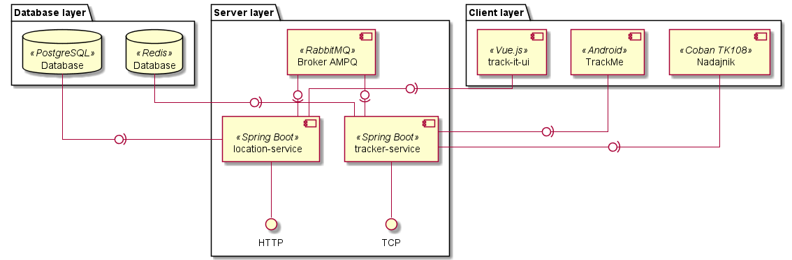

# TRACK IT 

## About 

**TrackIt** is application that allows You to save location data and visualize them on map.

#### Currently supported devices:
- COBAN trackers (tested with TK-108)
- Preapared Android application - [TrackMe](https://github.com/latusikl/TrackMe)

## Demo

[](https://youtu.be/QnfsEWAAMbQ)

## Architecture overview



## Technology stack
Java, Spring Boot, Vue.js, PostgreSQL, Redis, RabbitMQ

## Run it

<details>
<summary>
Prerequisites
</summary>
The simplest way to run whole application is to use provided `docker-compose` file. For this purpose it is required that You have *Docker* and *docker-compose* installed. See how to instal required software here: https://docs.docker.com/compose/install/.
</details>
</br>
<details>
<summary>
Starting it up
</summary>
In the same directory where the `docker-compose` file is located execute command:

```shell
docker-compose up
```

The following ports will be taken by started services.

Service | Port
--- | ---
tracker-service | 9000 (TCP Server)
location-service | 8090 (Tomcat)
track-it-ui | 80
RabbitMQ (broker) | 5672
RabbitMQ (management) | 8000
PostgreSQL (database) | 5432
</details>
</br>
<details>
<summary> Sample data </summary>
  
Inside `sample` directory there are sample data provided as SQL file that you can execute to insert them to database.

After adding sample data to application there are 2 users available;

|e-mail | password |
--- | ---
t@t.com | 35H2j115
lukasz@test.com | 35H2j115

For this users there are 3 devices added to the system. Below You can see information about them and also time ranges for which location data have been saved.

|User e-mail | Device name | Time range
--- | --- | ---
t@t.com | Mazda 3 TK108 tracker | 05.12.2020 15:55-17:45
lukasz@test.com | Lukasz phone | 06.12.2020 13:50-14:25,15:02-17:15
lukasz@test.com | Adam phone | 09.12.2020 15:05-15:35
</details>
</br>
<details>
<summary> Simulate tracking device </summary>

There is also possibility to test if application will receive data send from tracking device.

For that purpose You can send prepared TCP frames (e.g. using telnet) to tracker-service and simulate the device.

1. Sample device login frame

```
##,imei:864926030089768,A;
```

2. Packet with device location no.1

```
imei:864926030089768,tracker,200615104703,,F,104703.00,A,5102.54672,N,01858.35332,E,0.069,0;
```

3. Packet with device location no.2

```
imei:864926030089768,tracker,201016104803,,F,104803.00,A,5102.54672,N,01858.35332,E,0.069,0;
```

4. Packet with issue (will be visible in device logs) - location for given timestamp has already been saved.

```
imei:864926030089768,tracker,201116104803,,F,104803.00,A,5102.54672,N,01858.35332,E,0.069,0;
```

4. Packet with issue (will be visible in device logs) - location could not be determined.

```
imei:864926030089768,tracker,201016104703,,L,124703.00,A,,,,,,0;
```
</details>
